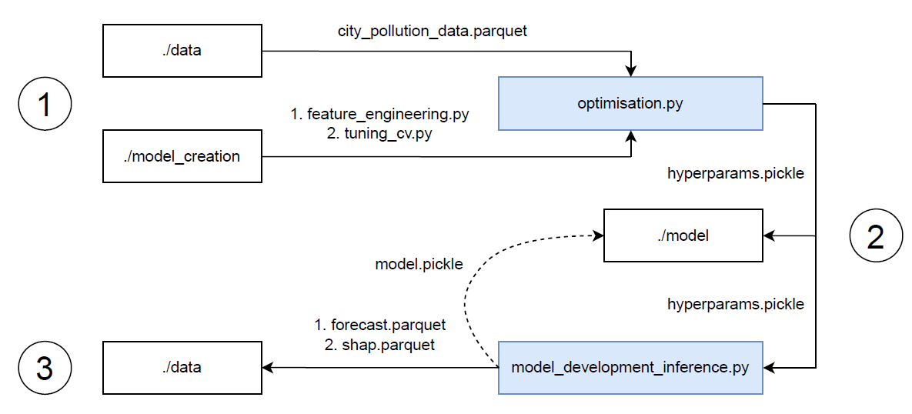

# CSCI6409 Project

## Contributors
* [Konstantin Zuev](https://github.com/ghginm) 
* [Mohammed Usama Jasnak](https://github.com/UsamaJasnak/) 
* [Siqi Wang](https://github.com/Ceecee2023)

## Goals

This project targets the critical issue of air pollution by building an Air Quality Forecasting System (AQFS). The objectives include conducting thorough data analysis to understand pollution patterns, creating a precise model for predicting air quality i.e. forecasting PM 2.5 (fine particles in the air that have a diameter of less than 2.5 micrometres), and enhancing the model's performance with advanced feature engineering and hyperparameter tuning.

## Project structure

```
Air-Quality-Forecasting-System/
|
├── data/
├── eda/
│   ├── data_processing_eda.ipynb
│   └── inference_eda.ipynb
├── model/
├── model_creation/
│   ├── feature_engineering.py
│   ├── training_testing.py
│   └── tuning_cv.py
├── utils/
│   └── data_utils.py
├── config.json
├── main.ipynb
├── model_development_inference.py
└── optimisation.py
```

## Project flowchart

<div align="center">
  <picture>
    
  </picture>
</div>

## File description

* <code>./data/</code>: stores all relevant data sources.

* <code>./eda/data_processing_eda.ipynb</code>: extensive EDA and data processing.
* <code>./eda/inference_eda.ipynb</code>: model performance analysis.

* <code>./model/</code>: stores all trained models as well as hyperparameters obainted after tuning.

* <code>./model_creation/feature_engineering.py</code>: creating feature engineering to transform hierarchocal time-series problem to ML one.
* <code>./model_creation/training_testing.py</code>: training models employing recursive forecasting and obtaining out-of-sample performance on the test set.
* <code>./model_creation/tuning_cv.py</code>: tuning models (Optuna, random search).

* <code>./utils/data_utils.py</code>: creating data quality reports.

* <code>./config.json</code>: a config file with key parameters for tuning, cross-validation and more.
* <code>./main.ipynb</code>: interactive notebook with EDA + model training and inference, i.e. a quick and reproducable example.
* <code>./model_development_inference.py</code>: model training / testing for a given dataset.
* <code>./optimisation.py</code>: model optimisation for a given dataset.